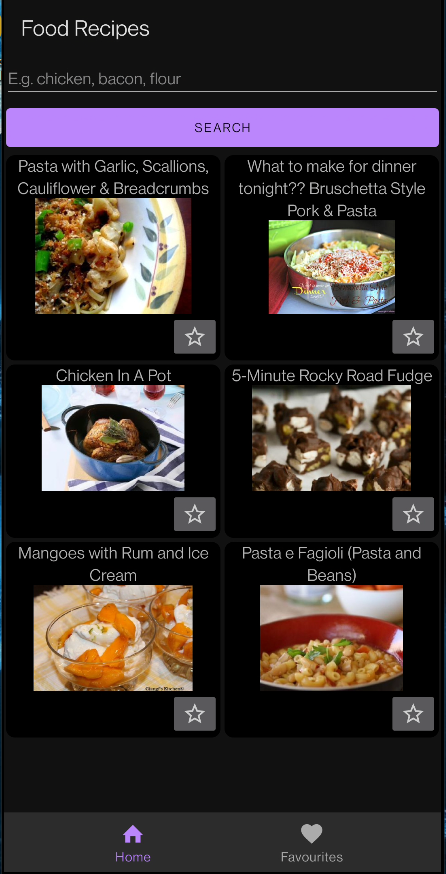
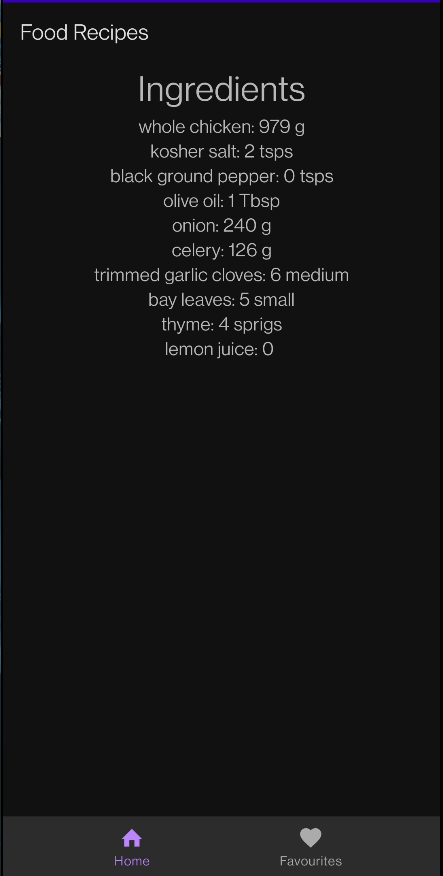
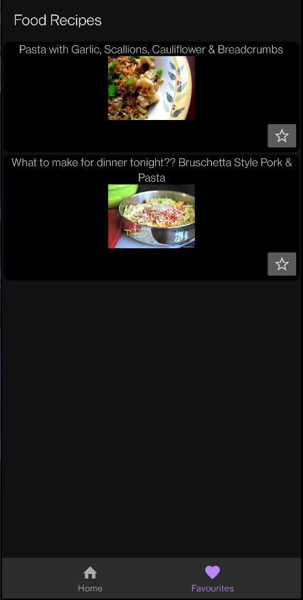

## Author
Aki Helin

## Topic
Mobile application which allows you to search for food recipes. API used = https://spoonacular.com/food-api  

## Target  
Android / Kotlin

## Screenshots

## How to use
Clone the repository, import the cloned folder FoodRecipes to Android Studio and run the app using an emulator or your own device.

## Youtube
https://youtu.be/pLKDdo9ZtMQ
